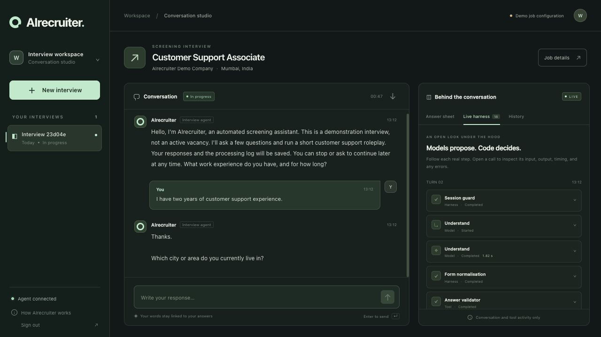

# OnlyRound — Screening Conversation Studio

[Open the live studio](https://recruitment-agent-production-382c.up.railway.app) · [Railway project](https://railway.com/project/68c38af2-b26a-4383-9e87-ab234e4e0c16)

OnlyRound runs a structured first-round text screening interview and shows how every turn was handled. A candidate chats with the bot; the studio displays the conversation, a live answer sheet, evidence history, and an expandable stack of model calls and code tools.

**The model understands and speaks. Code owns the questions, state, validation, and delivery.** This release records answers; it does not score candidates, judge suitability, recommend hiring decisions, or run an evaluation product. Voice, recruiter dashboards, and onboarding are outside this release.

The included Mumbai customer-support role is clearly labelled **demonstration data**, not an active vacancy. Replace `config/job.json` with approved criteria, facts and wording before using a real role. Each interview stores its own config snapshot so later config edits cannot silently change an existing interview.



## What you can do

- Start and resume interviews in one browser, including callback pauses.
- Answer several criteria in one message, correct an earlier answer, ask a job question, or decline to answer.
- Complete a three-turn customer-support roleplay and one candidate Q&A exchange.
- Inspect the evidence quote, status, conditions, confirmation state and follow-ups for every criterion.
- Expand real runtime events to inspect model input/output, duration, failed checks and fixed fallbacks.
- Export a session's complete audit record as JSON.

## The harnesses

A harness is the code surrounding a model call: it limits the model's input, checks its proposals and controls what happens next. The trace shows code tools as **tools** and model requests as **model calls**. These are real execution records, not simulated animations or hidden model reasoning.

| Layer | Responsibility |
|---|---|
| Session guard | Checks browser ownership, state, deadlines, active turn and idempotency key. |
| Understand | Model call 1 extracts answers, candidate questions, flags, stop and callback requests into a strict JSON schema. |
| Form normalisation | Converts missing or malformed optional values to predictable defaults. |
| Answer validator | Checks known criteria, supporting quotes, event routing, legal statuses, duplicate saves and neutral confirmation holds. Stores accepted **and rejected** proposals. |
| Job facts lookup | Selects only configured facts. Unknown questions are recorded and deferred to the recruiter. |
| Progression engine | Code selects exactly one approved question, manages follow-ups, confirmations, roleplay, pauses and closing. |
| Speak | Fixed lines for routine actions, or model call 2 for a short acknowledgement and grounded fact response. |
| Reply checker | Rejects praise/outcomes, extra questions, unsupported facts/numbers and long responses. One regeneration, then a fixed fallback. |
| Delivery commit | Stages the next action, returns the message, and commits the next question only after the browser renders and acknowledges it. |

```mermaid
flowchart LR
  A[Candidate message] --> B[Session guard + save raw text]
  B --> C[Understand model]
  C --> D[Normalize + validate]
  D --> E[Save evidence and append history]
  E --> F[Facts + progression tools]
  F --> G[Fixed line or Speak model]
  G --> H[Reply checker]
  H --> I[Durable reply outbox]
  I --> J[Browser renders reply]
  J --> K[Delivery ACK commits next action]
```



The Understand context contains the current criterion's completion definition, other criteria's **statuses only**, hints, fact topic names, and up to six prior candidate messages. It does not contain saved answers, bot replies, knockout rules, scoring rules or other candidates' data. The model cannot call a tool to change a question, write a verdict, or skip an interview step.

## Storage and uniqueness

Production uses **one PostgreSQL database with a persistent Railway volume**. Local development uses SQLite with foreign keys and WAL enabled. Separate tables hold interviews, turns, messages, answer sheets, append-only answer history, candidate questions, flags, hints, runtime events, and schema versions.

All record IDs are random UUIDs with database primary keys. Logical identity is also protected by unique database constraints:

- One interview per browser owner + creation request ID.
- One turn per interview + message request ID.
- One candidate and one assistant message per turn.
- One answer row per interview + criterion.
- One accepted candidate save per message + criterion.
- One flag per message + flag type, and one hint per source message + criterion.

Sending the same text intentionally twice with different request IDs creates two distinct turns. Network retries reuse the same request ID and return the existing record. A request ID reused with changed text is rejected.

Raw candidate text is durable before the model runs. Accepted answer changes and their history are saved in one transaction. The proposed next question and follow-up changes remain staged in the turn until the browser acknowledges delivery. If a response is interrupted, reloading recovers the staged reply; acknowledging it again is safe. A failed turn retries with its original key and reuses any already validated result. Active attempts are fenced so an expired attempt cannot overwrite a retry.

## Run locally

Requires Python 3.9+ (the production image uses Python 3.12).

```sh
cp .env.example .env
# Set OPENAI_API_KEY in .env. Keep it private.
sh start.sh
```

Open `http://localhost:8000`. Set `PORT` to change the port. Without a key, the interface and records are available, but model-backed messages are disabled. `OPENAI_MODEL` defaults to `gpt-4.1-mini` and must support strict Chat Completions structured outputs. API usage is billed to the configured OpenAI account.

```sh
PYTHONDONTWRITEBYTECODE=1 .venv/bin/python -m pytest -q
```

The tests verify deterministic conversation and persistence behavior with controlled model responses. They are implementation tests, not candidate scoring or a model-evaluation pipeline. They cannot prove that every live model interpretation is correct.

## Railway deployment

The repository contains `Dockerfile` and `railway.toml`. Deploy this repository's `main` branch as one web service alongside one standard Railway Postgres service. The app uses the private database connection; the database does not need a public domain.

Required web-service variables:

| Variable | Value |
|---|---|
| `DATABASE_URL` | `${{Postgres.DATABASE_URL}}` |
| `OPENAI_API_KEY` | Server-side API key |
| `OPENAI_MODEL` | `gpt-4.1-mini` or another compatible configured model |
| `ACCESS_CODE` | Long random studio access code |
| `COOKIE_SECRET` | Long random cookie-signing secret; keep stable across deployments |
| `ENVIRONMENT` | `production` |

Railway provides `PORT`. `/health` checks database connectivity. The app refuses production startup without PostgreSQL and both access secrets. Initial schema creation is idempotent; future destructive schema changes require an explicit migration. One web process is configured; database constraints, row locks and attempt fencing protect turn operations.

The studio is intended for authorized testing and operation. Production access uses a shared access code, signed HttpOnly cookies, browser-scoped session ownership, same-origin write checks and security headers. Clearing the browser cookie loses that browser's access to its interviews; the database retains the records. A team identity system, cross-device session management and a formal retention workflow are future work.

## Source layout

```text
app/engine.py       Pure validator, progression, facts, reply checks
app/model.py        Bounded OpenAI calls, strict schemas, trace emission
app/storage.py      Relational schema, transactions, uniqueness
app/main.py         HTTP API, authentication, turn orchestration, delivery ACK
config/job.json    Demo job criteria, facts, approved wording and roleplay
prompts/            Model instructions (no scoring or hiring rules)
web/                Responsive conversation studio and live inspector
tests/              Engine and API regression tests
docs/source-spec.md Original supplied specification
docs/decisions.md   Scope choices and practical limits
```

## Practical limits

The validator proves structural validity and quote support, not semantic correctness. A model can still misunderstand a genuine quote; the answer sheet and trace make that visible. Serious flags are best effort; underage classification is narrowly corroborated against explicit age wording. A confirmed knockout refusal only changes interview flow; this release never produces a hiring verdict. Callback requests are stored as a pause, not scheduled telephone calls.

Prompts and responses may contain candidate information. Access is restricted to the authorized browser session, and credentials are excluded from logs and Git. There is no public session listing or public transcript endpoint. Configure actual job facts and consent/retention wording appropriate to your intended deployment.

API implementation follows [OpenAI structured outputs documentation](https://developers.openai.com/api/docs/guides/structured-outputs).
